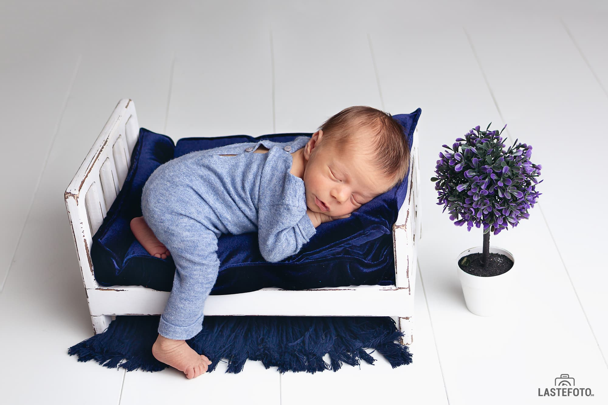
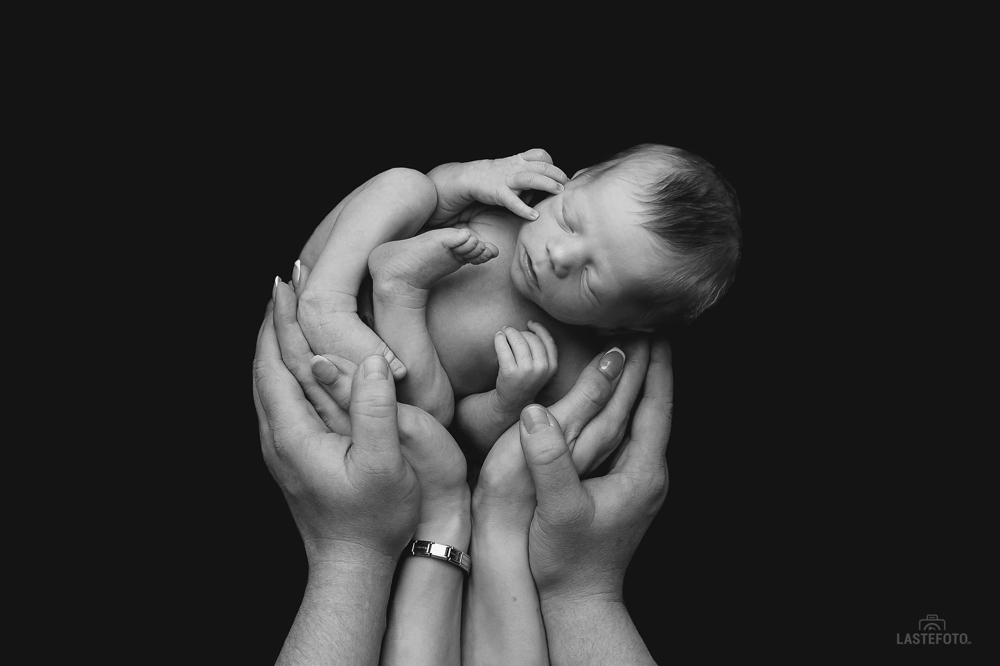
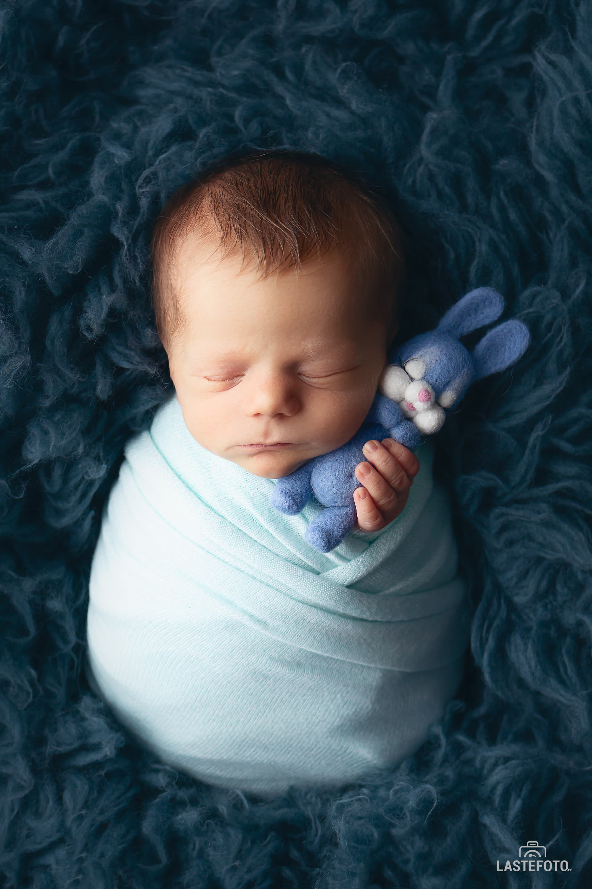

## My baby is so tiny; perhaps we could put off the photo shoot till he gains strength and develops a little?

No, not really. By refusing to have a newborn photographed, you miss the opportunity to capture the priceless moments of your baby's early days, which are certainly deserving of inclusion in your family photo album. Right now, the baby has a lovely, vulnerable look. He or she will change significantly in a short period of time.

 

## How do you photograph a baby who only sleeps and eats? 

A newborn photographer can really benefit from a long, deep sleep. All of our photo ideas can come to life with a sleeping baby. But what should you do if the baby is awake? In my experience, there has never been a newborn photo session where a baby was awake the entire time. Although I always advise blocking off enough time for the photo shoot—roughly 2-3 hours—and not scheduling crucial activities (like visiting the doctor) for the afternoon.

## Are poses safe for the newborn?

The poses used by a skilled newborn photographer are indeed safe for the baby. They don't bother him in any way, and the baby keeps on sleeping blissfully and sweetly. Make sure the newborn photographer you choose have the required qualifications. You can find out what training courses the photographer did in newborn photography by asking him or by checking his website.

## Baby picture shoots often take place in a studio. Is it clean enough?

Yes, the cleanliness of newborn photography studios is checked regularly. The studio has all the equipment you'll need for shooting. The temperature is kept at a level that is comfortable for the baby, and the props are frequently cleaned with substances suitable for newborns.

Every moment in your baby's life is worth capturing, so enjoy the first photo shoot! ❤️

