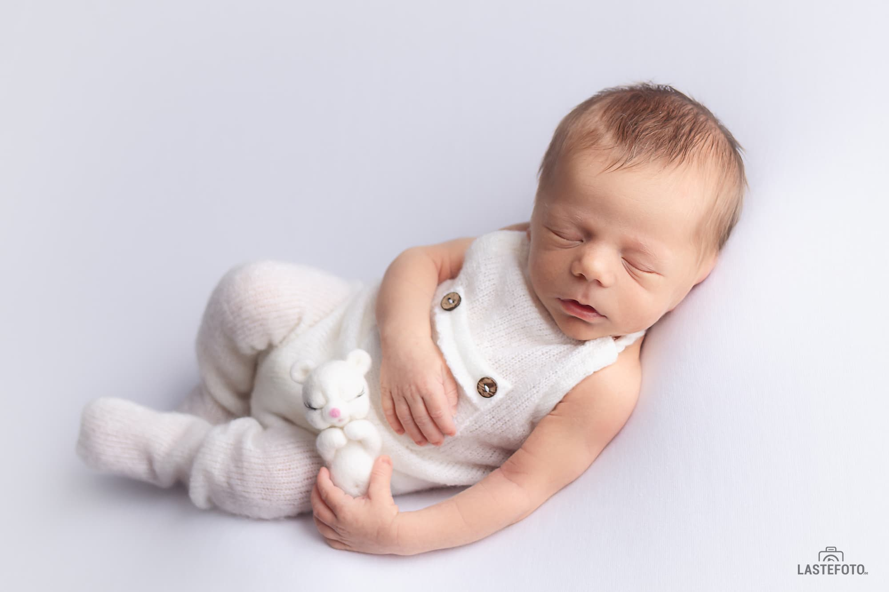

## Minu beebi on nii väike, äkki on parem kui lükkame fotosessiooni natuke edasi?

Tegelikult pole parem, sest keeldudes vastsündinu pildistamisest, jätate kasutamata võimaluse jäädvustada beebi esimeste päevade olulisi hetki, mis on teie perekonna fotoalbumi tõeliselt väärt. Teie beebi on praegu nii pisike. Mõne kuu pärast on ta täiesti teine.

 

## Kuidas vastsündinut pildistada, kui ta ainult sööb ja magab?

Pikk ja sügav uni - tõeline kingitus fotograafile. Magava beebiga saame realiseerida kõik pildistamise ideed. Aga mida teeme kui beebi ei maga? Minu praktikas pole veel beebisid olnud kes on jäänud ärkvel terve fotosessiooni ajal. Kuigi soovitan alati pildistamiseks piisavalt aega kõrvale jätta - umbes 2-3 tundi ja mitte planeerida olulisi tegevusi (näiteks arsti juurde minekut) päeva teiseks pooleks.

## Kas need poosid on ohutud?

Jah, poosid, mis teeb kogenud professionaalne vastsündinu fotograaf on ohutud. Poosid ei tekita beebile absoluutselt mingit ebamugavust - ta magab jätkuvalt rahulikult ja armsalt. Fotograafi valimisel vaadake kindlasti, et tal oleks sobiv kvalifikatsioon. Selleks võite küsida fotograafilt või vaadata kodulehelt, millistes vastsündinute pildistamise koolitustes ta osales. 

## Vastsündinu fotosessioon tavaliselt toimub stuudios. Kas seal on piisavalt puhas?

Jah, vastsündinu pildistamisele spetsialiseerunud stuudiotes jälgivad puhtust. Stuudios on kõik pildistamiseks vajalik. Stuudios hoiakse beebi jaoks mugavat temperatuuri ja rekvisiite töödeldakse regulaarselt vastsündinutele ohutute vahendite abil.

Nautige oma beebi esimest fotosessiooni, sest iga hetk on jäädvustamist väärt! ❤️

